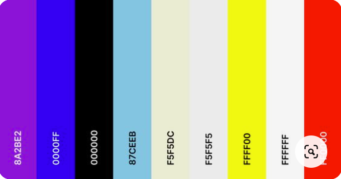

# Developer: Aldwin Arriola

## Table of content
1. [Purpose of the project](#purpose-of-the-project)
2. [User stories](#user-stories)
3. [Features](#features)
4. [Typography and color scheme](#typography-and-color-scheme)
5. [Wireframes](#wireframes)
6. [Technology](#technology)
7. [Testing](#testing)
   - 7.1 Code Validation
   - 7.2 test cases (user story based with screenshots)
   - 7.3 fixed bugs
   - 7.4 supported screens and browsers
8. Deployment
   - via gitpod
   - via github pages
9. credits

## Purpose of the project
This Private beach house website was made for portfolio project #1 (HTML&CSS) for Diploma in Full Stack Software Development at [Code Institute](https://codeinstitute.net/).
## User stories
as a developer, I want to be able to inform and show users how beautiful the place is, so they can experience what it feels like to vacation in a private beach house and enjoy it with family, or friends.
## Features
- ### A Simple, Easy to Remember URL:[Reyna beach house](https://araldwin.github.io/Project-1/)
-----
- ### A Clear Description of My Business

-----
- ### Call to Actions

-----
- ### Contact Information:

-----
- ### This website is mobile friendly or responsive design that fits standard screen sizes.

-----
## Typography and color scheme
### Typography
- I used two fonts in this project, they are Monserrat and Lato, Monserrat for Headings and Lato for the rest, with both fall backs being Sans-serif. This Font is simple and adapted to the website and it is linked to the CSS document via @import.

### Color Scheme
- in this website I used colors blue violet #8A2BE2, sky blue #87CEEB, blue #0000FF, white #FFFFFF, yellow #FFFF00, and black #000000 for the font-texts. and other specified colors such as beige #F5F5DC, cultured #F5F5F5 are for the background of other elements, and red for the Contact us Icon. I used these colors to match and have a beach house atmosphere. so that the user can clearly read such a website it is cool to the eyes and relaxing color.

-----
## Wireframes
- [Balsamiq](https://balsamiq.com) - i used balsamiq to create [wireframes](https://balsamiq.cloud/shny6lm/pz4i6g4/rE2F0) for my project.
-----
## Technology
### Languages used
- HTML5
- CSS3
### Others
- [Am I Responsive](https://ui.dev/amiresponsive) - - online tool used to create mockup to present responsive design of this project.
- [Coolors.co](https://coolors.co) - used to create color palette.
- [Fontawesome](https://fontawesome.com/icons/) - where i import font icons for this project.
- [Google Fonts](https://fonts.google.com) - where i import and use font-style for this project.
- [Google maps](https://google.com/maps) - I used to embed the map at the Reyna beach house location.
- [Git](http://gitscm.com) - Git was used for version control by utilizing the Gitpod terminal to commit to Git and Push to GitHub.
- [Gitpod](https://gitpod.io) - IDE used to code the project.
- [GitHub](https://github.com) - GitHub is used to store the project's code after being pushed from Git.
- [Logo maker](https://play.google.com/store/apps/details?id=splendid.logomaker.designer&hl=en&gl=US) - I used it to make my logo.
- [Visual Studio Code for Windows]() - IDE used to code the project.
- [Windows Snipping Tool] - used to save the screen shot.
-----

## Testing
### 7.1 Code Validation
- [W3C CSS Validation Service](https://jigsaw.w3.org/css-validator/#validate_by_input) - used to validate the project css.

-----
- [Nu Html Checker](https://validator.w3.org/nu/#textarea) - used to check the project html.
   - index.html

-----
   - 
